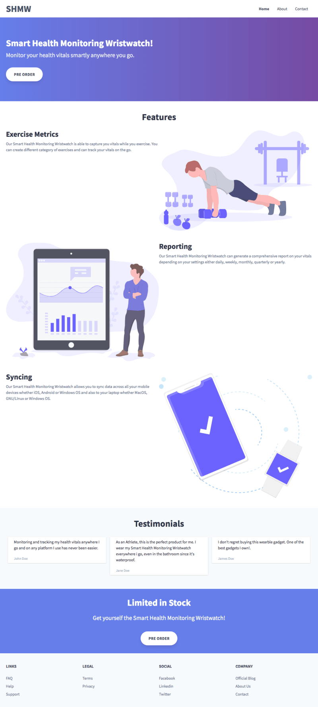

# Lab #1. Health monitoring smart wristwatch (HMSW)

https://scotch.io/tutorials/build-a-beautiful-landing-page-with-tailwind-css

- использую `lite-server`
- emmet
- <kbd>CTRL + SHIFT + A</kbd>, <kbd>CTRL + L</kbd>

## What we'll be building

In this tutorial, we’ll be building a simple but yet beautiful landing page to showcase a health monitoring smart wristwatch (HMSW) product to our customers.

Our landing page will be divided into the following:
- Navbar
- Hero section
- Features section
- Testimonials
- Call to action
- Footer

## Step 1. Add `index.html`

## Step 2. Building the navbar

## Step 3. Building the hero section

## Step 4. Building the features section

## Step 5. Building the testimonials section
